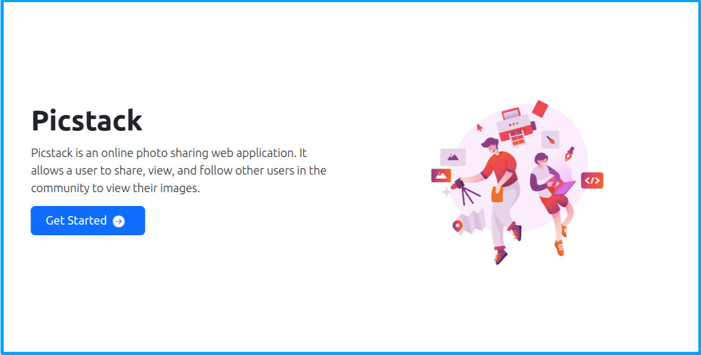

# Picstack

This is a Django personal gallery application that displays my photos for others to see.

# Django Admin Login
To access the admin dashboard, follow the instructions below:

* Navigate to `https://picstackone.herokuapp.com/admin`
* Username: `kelvin`
* Password: `ruut@321`

## Project Run-Through
* A few details about this project:

## Contribution
- [Kelvin Mburu](https://github.com/kelvinmburu) 📖

## Technology Used

1. Python 3.8
2. [Django version 4](https://docs.djangoproject.com/en/4.0/)
3. HTML, CSS and JavaScript
4. Pip
## Project Requirements & Prerequisites

1. IDE of Choice
2. Python3
3. Browser

* Please ensure you're working from a Windows/MacOS/Linux
* Install Django through `pip install django`

## Project Setup and Installation

1. Proceed to this [link](https://github.com/kelvinmburu/picstack.git) and clone the repository.
2. Extract the folder and `cd` to the folder on your terminal or your prefered IDE
3. In the terminal, create a virtual environment: `python3 -m venv virtual` and activate it through `source virtual/bin/activate`. In the case of any name, please use `source <name>/bin/activate` or refer to this [documentation](https://stackoverflow.com/questions/31252791/flask-importerror-no-module-named-flask) for Flask virtual environment installation.
4. Install all dependencies from the `requirements.txt` file; use `pip install -r requirements.txt` to install needed dependencies.
6. In the terminal, and within the project folder, run `python manage.py runserver` to start the project.
7. View the application on your browser on `http://127.0.0.1:8000`. If you have another project running on another port, use `venv run --host 0.0.0.0 --port 8001` to switch to a new port; You can use a different port number.

## Behavior Driven Development (BDD)

The BDD focuses on how a user interacts with the application.

At a minimum, this is what the user should experience in the application:

## Project Contribution or Development:

To contribute to this project, please follow the following steps:
* Fork this repository.
* Create a branch: `git checkout -b <branch_name>`.
* Make your changes and commit them: `git add .` && `git commit -m '<commit_message>'` && `git push origin <branch_name>`
* Push to the original branch: `git push origin <flask-news>/<main>`
* Create the pull request.
* Once a PR is reviewed, the changes will be pushed to the main branch for integration.

Please see the GitHub documentation on [Creating a Pull Request](https://help.github.com/en/github/collaborating-with-issues-and-pull-requests/creating-a-pull-request)

## Known Issues & bugs

To improve this project or fix a bug, please reach me via Email:
* [mburuhkelvin@gmail.com](mailto:mburuhkelvin@gmail.com)
* [kelvin.anjiku@student.moringaschool.com](mailto:kelvin.anjiku@student.moringaschool.com)

Alternatively, you can contact me via [LinkedIn](https://www.linkedin.com/in/kelvin-m-560a25135/)

## License

Please view the project [LICENSE](LICENSE) for more information.